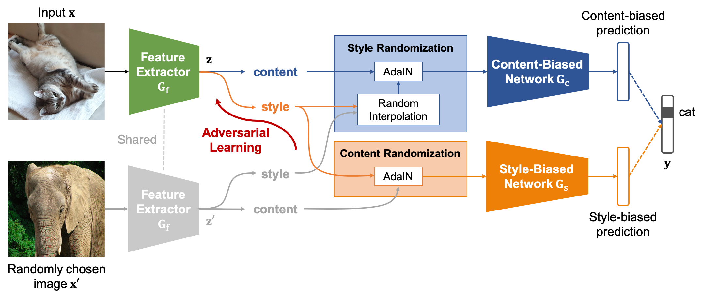

# Style-Agnostic Networks (SagNets)
By Hyeonseob Nam, HyunJae Lee, Jongchan Park, Wonjun Yoon, and Donggeun Yoo.

Lunit, Inc.

### Introduction
This repository contains a pytorch implementation of Style-Agnostic Networks (SagNets) for Domain Generalization.
It is also an extension of our method which won the first place in Semi-Supervised Domain Adaptation of [Visual Domain Adaptation (VisDA)-2019 Challenge](https://ai.bu.edu/visda-2019/).
Details are described in [Reducing Domain Gap by Reducing Style Bias](https://openaccess.thecvf.com/content/CVPR2021/papers/Nam_Reducing_Domain_Gap_by_Reducing_Style_Bias_CVPR_2021_paper.pdf), **CVPR 2021 (Oral)**.

### Citation
If you use this code in your research, please cite:

```
@inproceedings{nam2021reducing,
  title={Reducing Domain Gap by Reducing Style Bias},
  author={Nam, Hyeonseob and Lee, HyunJae and Park, Jongchan and Yoon, Wonjun and Yoo, Donggeun},
  booktitle={Proceedings of the IEEE/CVF Conference on Computer Vision and Pattern Recognition},
  year={2021}
}
```

### Prerequisites
- [PyTorch 1.0.0+](https://pytorch.org/)
- Python 3.6+
- Cuda 8.0+

### Setup
Download [PACS](http://www.eecs.qmul.ac.uk/~dl307/project_iccv2017) dataset into ```./dataset/pacs```
```
images ->  ./dataset/pacs/images/kfold/art_painting/dog/pic_001.jpg, ...
splits ->  ./dataset/pacs/splits/art_painting_train_kfold.txt, ...
```

### Usage
#### Multi-Source Domain Generalization
```
python train.py --sources Rest --targets [domain] --method sagnet --sagnet --batch-size 32 -g [gpus]
```
#### Single-Source Domain Generalization
```
python train.py --sources [domain] --targets Rest --method sagnet --sagnet --batch-size 96 -g [gpus]
```
Results are saved into ```./checkpoint```
